# 🎓 Aadhaar–DBT Awareness & Verification Platform

**Smart India Hackathon (SIH) 2025 Grand Finale runner up project**

      
            

`#SmartIndiaHackathon` `#SIH2025` `#GovTech` `#DigitalIndia` `#DBT` `#Aadhaar`  
`#AI` `#Chatbot` `#IVR` `#WhatsAppBot` `#Analytics` `#PublicWelfare`

## 👤 Author

**Sahil Bhagwat**  
B.Tech CSE (Artificial Intelligence), VIIT Pune  
Smart India Hackathon 2025 – Grand Finalist & Runner-Up

  

**Lakshya Gupta**  
B.Tech CSE (Artificial Intelligence & Machine Learning), VIIT Pune  
Smart India Hackathon 2025 – Grand Finalist & Runner-Up

## 🏆 Hackathon Context

This project was developed as part of **Smart India Hackathon (SIH) 2025 Grand Finale** for the problem statement '**Enhancing Student Awareness on difference between Aadhaar linked and Direct Beneficiary Transfer(DBT) enabled Aadhaar seeded bank account.**', provided by '**Ministry of Social Justice & Empowerment (MoSJE)**' focusing on solving real-world governance and citizen-centric challenges using technology.

---

## 📑 Index

<!-- - [Author](#-author) -->

- [Problem Statement](#-problem-statement)
- [Solution Overview](#-solution-overview)
- [User Portal (Frontend)](#-user-portal-frontend)
- [Admin Panel](#-admin-panel)
- [WhatsApp Chatbot](#-whatsapp-chatbot)
- [IVR System](#-ivr-system-inclusion-focused)
- [Key Highlights](#-key-highlights)
- [Tech Stack](#-tech-stack-indicative)
- [Future Scope](#-future-scope)
- [Screenshots](#screenshots)
  <!-- - [IVR Audio Samples](#-ivr-audio-samples) -->
  <!-- - [Hackathon Context](#-hackathon-context) -->

## 📌 Problem Statement

Enhancing student awareness on the **difference between Aadhaar-linked bank accounts and DBT-enabled Aadhaar-seeded bank accounts** to reduce scholarship delays, rejections, and failures.

Many students mistakenly believe that linking Aadhaar with a bank account is sufficient for receiving scholarships via DBT (Direct Benefit Transfer). In reality, **proper Aadhaar seeding and DBT mapper activation** are required. This lack of awareness causes large-scale payment failures and repeated grievances.

---

## 💡 Solution Overview

This project is a **multi-channel, inclusive, AI-assisted awareness and guidance platform** that helps students:

- Understand the correct concepts
- Verify their Aadhaar–DBT status
- Take corrective action
- Get support through **digital and non-digital channels**

The solution combines **web, WhatsApp, IVR, AI analytics, and physical CSC support** to ensure maximum reach and impact.

---

## 🧑‍🎓 User Portal (Frontend)

### 🔐 Authentication

- Aadhaar number + OTP based login
- Implemented using **DigiLocker(dummy) authentication**

### 🧩 Features

#### 1️⃣ Know the Difference

- Clear explanation of:
  - Aadhaar-linked bank account
  - Aadhaar-seeded & DBT-enabled bank account
  - Steps to be followed to get your aadhar seeded
- Eliminates common misconceptions causing DBT failures

#### 2️⃣ Check Status

- Allows users to check whether:
  - Aadhaar is seeded to any bank account
  - DBT mapping is active or not

#### 3️⃣ Community & Engagement

- Interactive quizzes
- Improves awareness retention and student engagement

#### 4️⃣ Tools & Resources

- Official **government circulars** (uploaded by admin)
- Curated **educational YouTube videos**
- Reduces misinformation and confusion

#### 5️⃣ Website Chatbot

- AI-powered chatbot to answer common student queries instantly

#### 6️⃣ Nearby CSC Center Finder

- Location-based discovery of nearby **Common Service Centres (CSCs)**
- Helps students who prefer physical assistance

---

## 🛠️ Admin Panel

Designed for governance, monitoring, and targeted awareness campaigns.

### 🔧 Features

- **Content Management**

  - Upload government circulars and educational videos

- **Broadcast Notifications**

  - Send emails to students whose Aadhaar is not DBT-seeded (from database)

- **User Alerts**

  - Display important announcements on the user portal

- **Analytics Dashboard**

  - Visual graphs showing:
    - User engagement
    - State-wise, city-wise, and category-wise awareness gaps
  - AI-generated summary insights to identify:
    - Regions and demographics requiring focused awareness

- **Call Queries Management**
  - Stores IVR-generated queries
  - Enables helpline executives to call users back

---

## 🤖 WhatsApp Chatbot

- AI-based WhatsApp chatbot
- Multilingual text based and audio based inputs
- Enables instant help on a platform students already use

---

## ☎️ IVR System (Inclusion-Focused)

Designed for students with limited internet access or low digital literacy.

### 🔊 Features

- Supports **3 languages**:
  - Hindi
  - Marathi
  - Rng
- IVR Menu Options:
  1. Know the difference
  2. Check Aadhaar–DBT status
  3. Talk to a helpline executive

---

## Extra Awareness (On Field)

graphical poster that can be added up on notice boards in gram panchayat schools and colleges to spread awareness, attached in the ending of readme under screenshots

---

## 🔑 Key Highlights

- ✅ Multi-channel access: Web, WhatsApp, IVR, CSC
- ✅ Inclusive design for tech & non-tech users
- ✅ Data-driven decision making using analytics & AI
- ✅ Preventive approach instead of post-failure grievance handling
- ✅ Scalable GovTech solution aligned with Digital India & DBT goals

---

## 🏗️ Tech Stack (Indicative)

- **Frontend:** React, Tailwind
- **Backend:** Node.js, Express.js
- **Database:** MongoDB
- **Authentication:** DigiLocker dummy created by us (Aadhaar OTP)
- **AI:** Gemini & Twilio & Flask (Chatbot & Analytics Summary)
- **IVR:** Twilio & Express.js

---

## 🚀 Future Scope

- Integration with official NPCI DBT mapper APIs
- Mobile application
- Multi-language regional expansion
- Government dashboard for policymakers
- Real-time grievance redressal integration

---

## Screenshots

Below are some screenshots showcasing the major features of the platform.

### 🔐 User Authentication (DigiLocker Login)

### 🧑‍🎓 User Dashboard

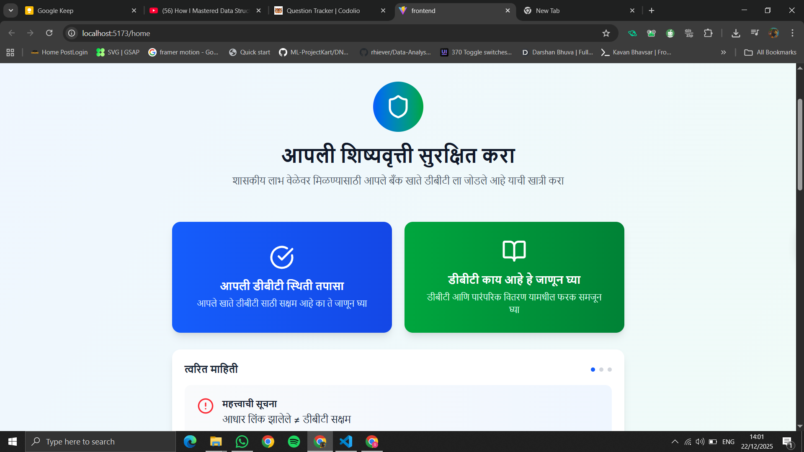
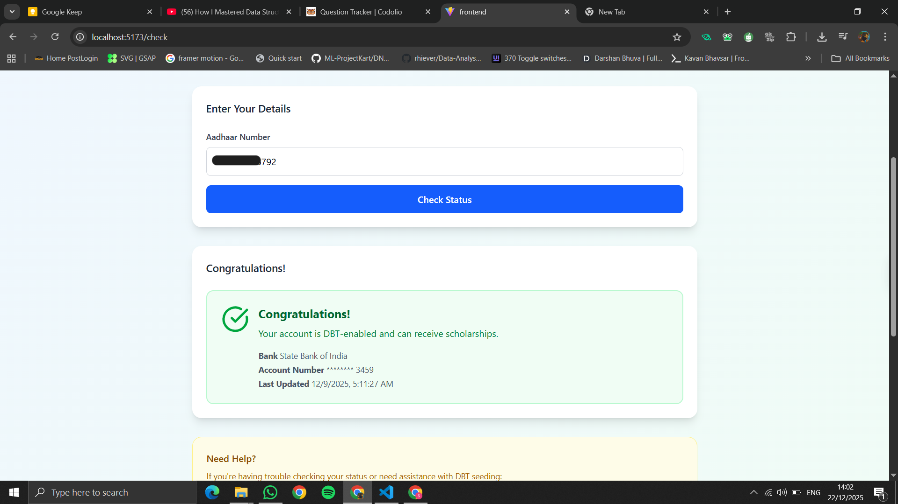
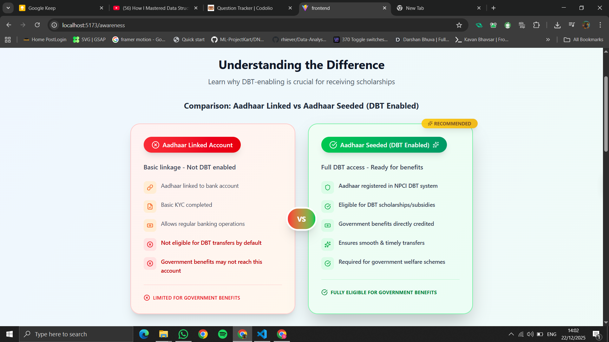
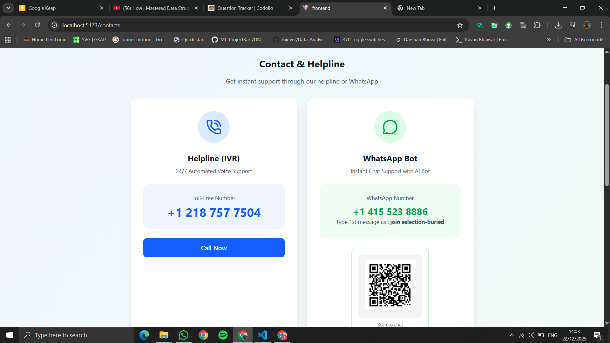
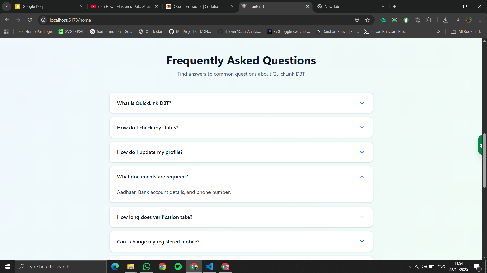
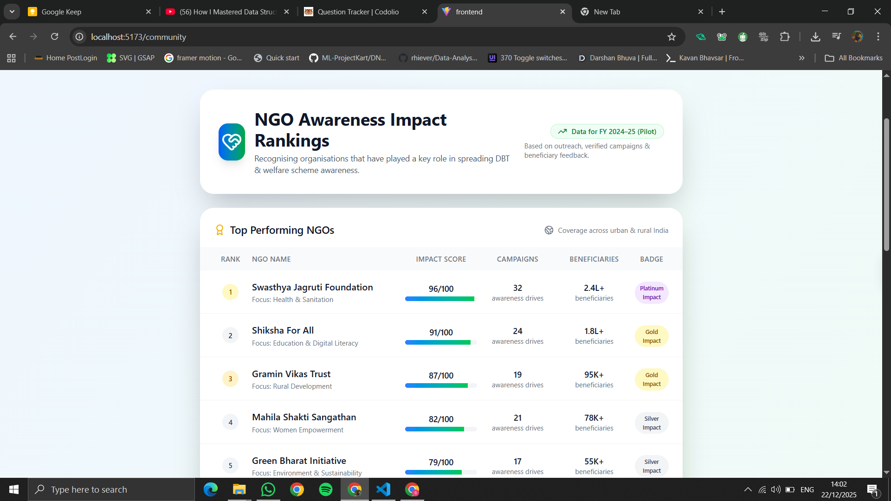
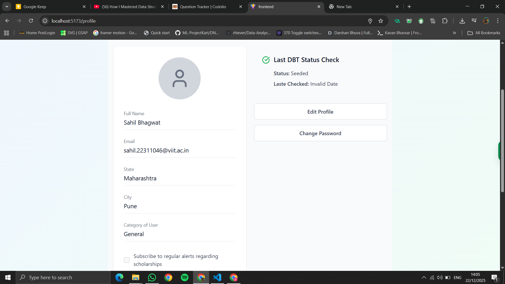
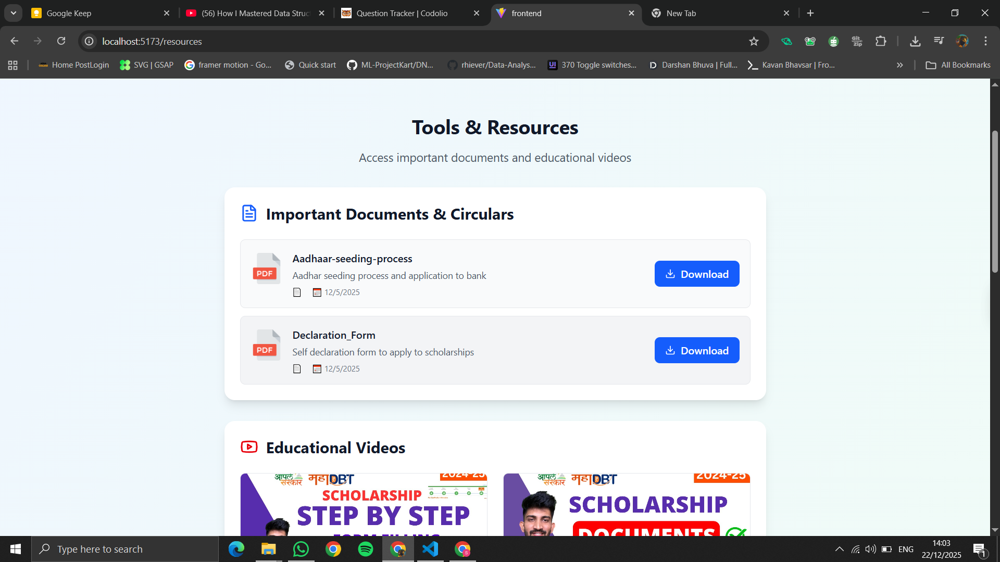
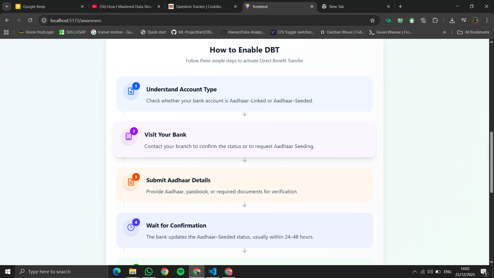

### 📊 Admin Analytics Dashboard

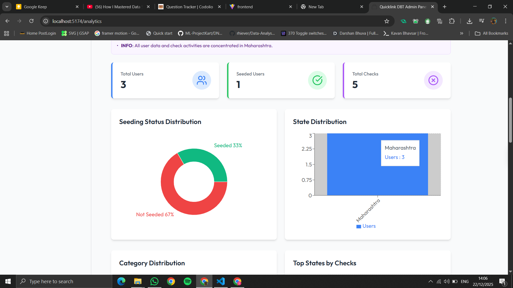
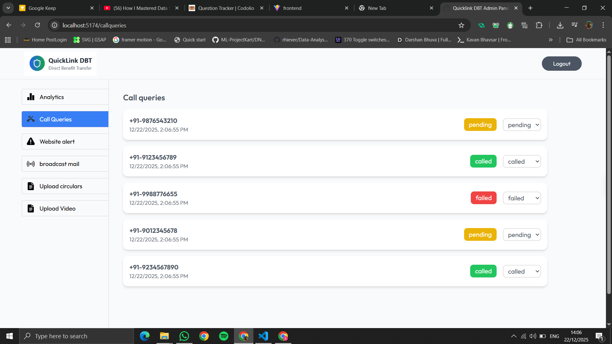
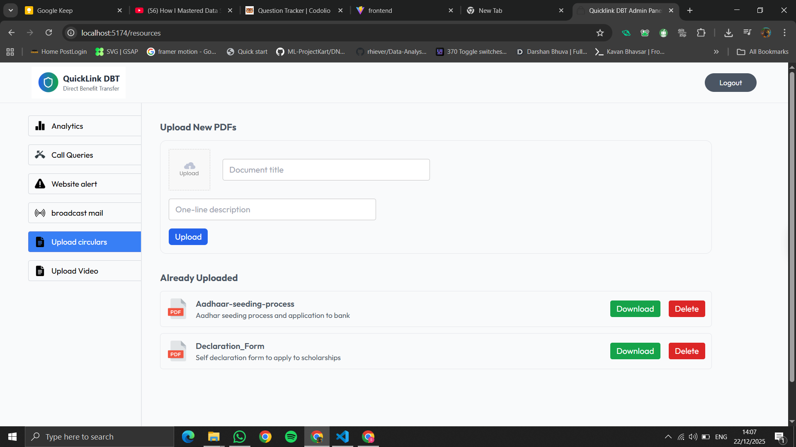
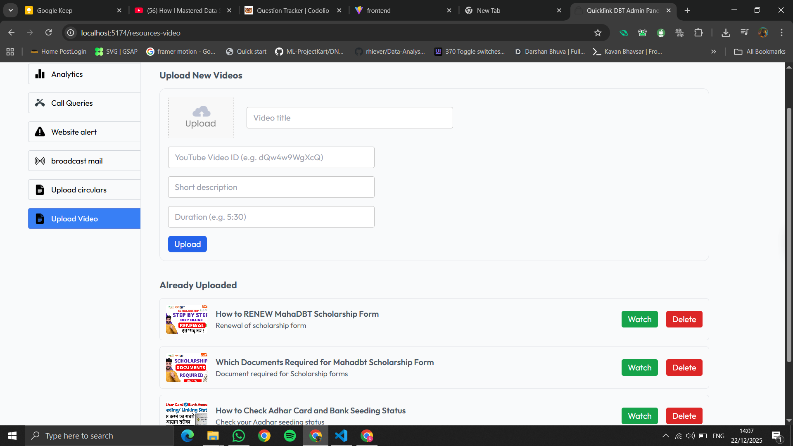

### 🤖 Website Chatbot and Whatsapp Chatbot

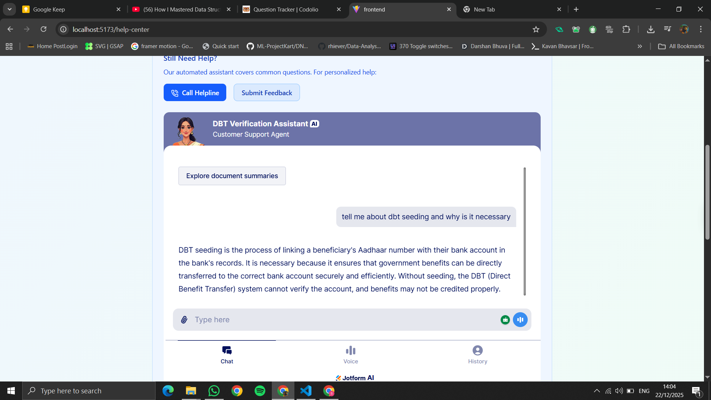
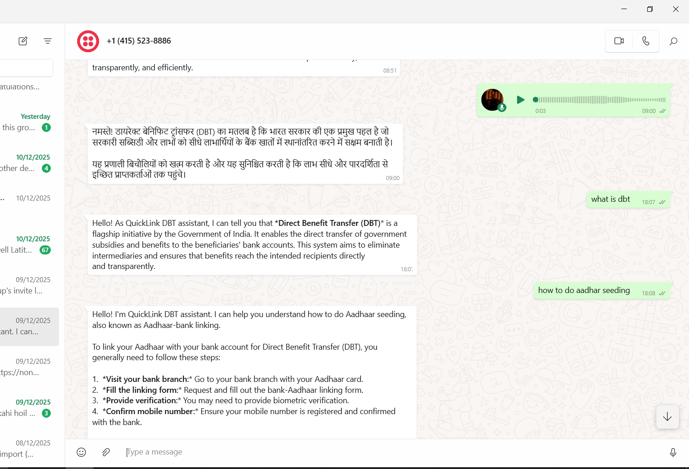

### 📍 Nearby CSC Center Finder

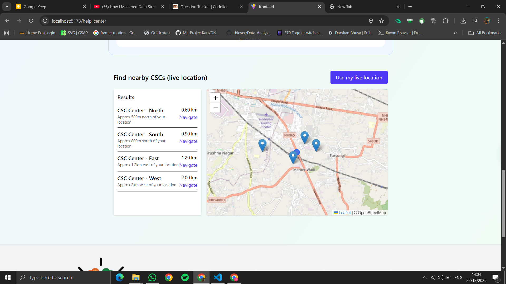

### Awareness Poster

### Team Photo

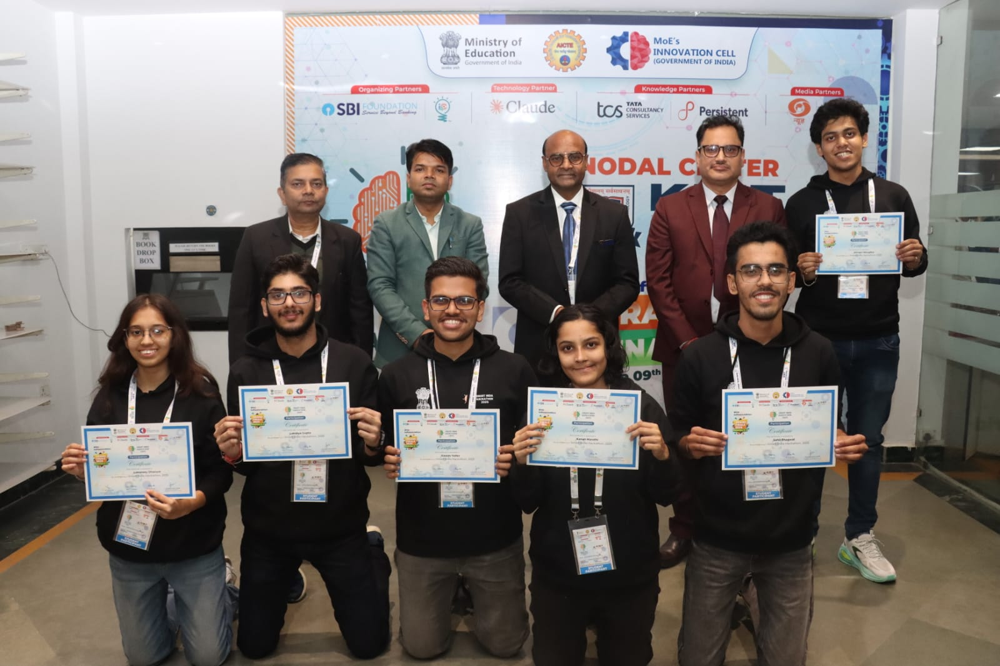

> 📌 **Note:**  
> All screenshots are available inside a `/screenshots` folder in the root of the repository.
